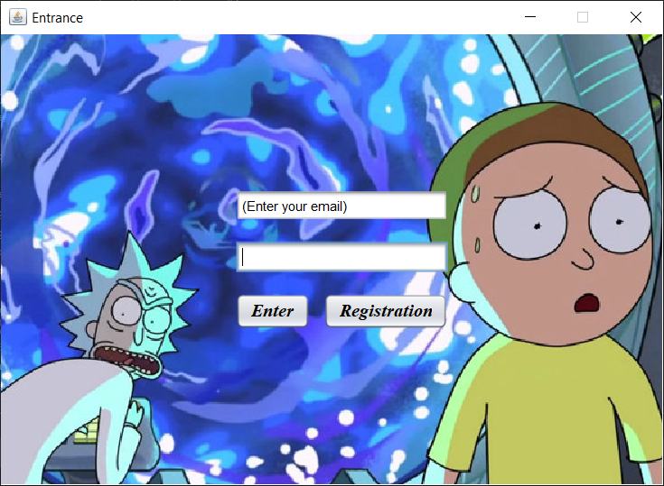
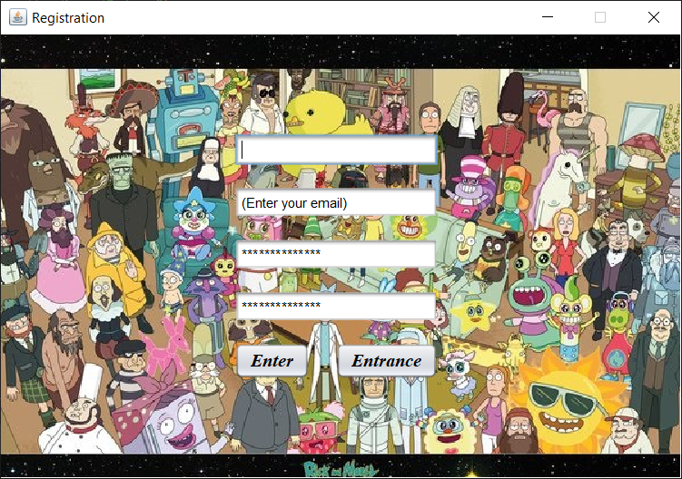
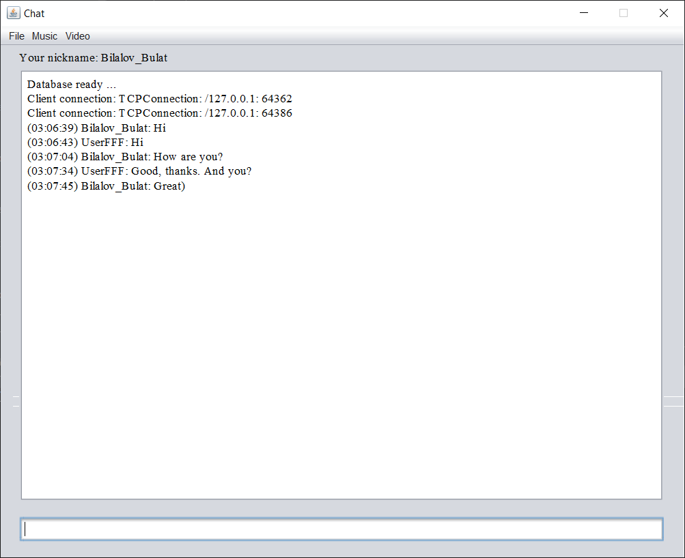
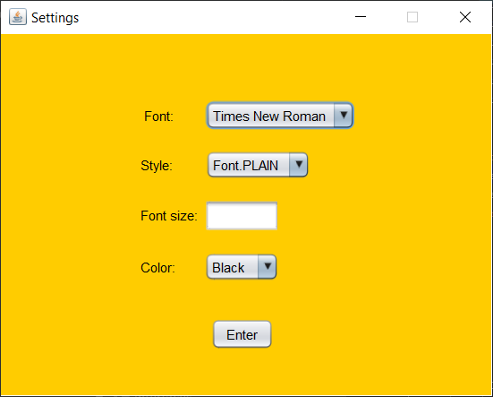
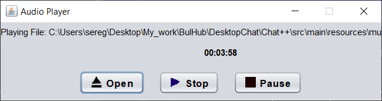
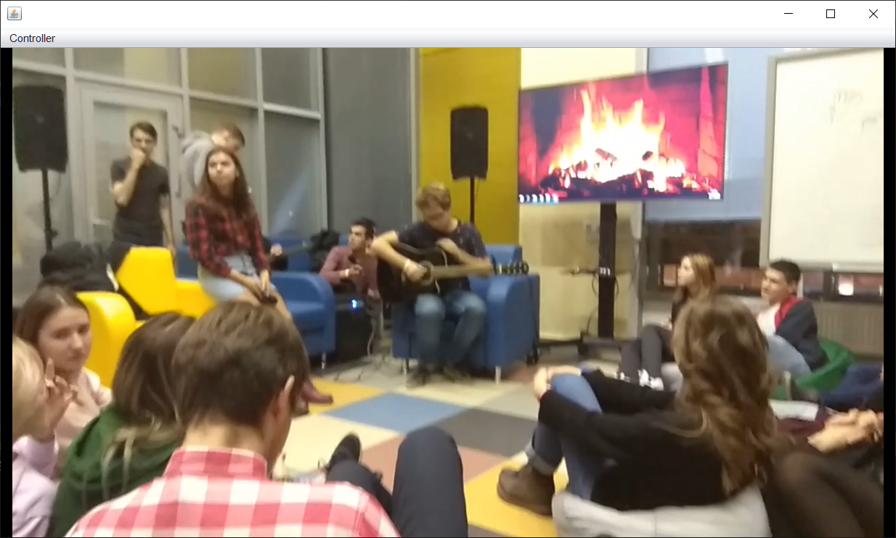

## Чат, написанный на языке программирования Java с применением:

+ JDBC (англ. Java DataBase Connectivity - соединение с базами данных на Java) - платформенно независимый промышленный стандарт взаимодействия Java-приложений с различными СУБД.

+ Swing - это библиотека, которая содержит необходимый набор компонентов для создания графического интерфейса пользователя. С помощью Swing можно написать десктопное приложение на Java.

+ PostgreSQL — свободная объектно-реляционная система управления базами данных (СУБД).

+ Apache Maven — фреймворк для автоматизации сборки проектов на основе описания их структуры в файлах на языке POM (англ. Project Object Model), являющемся подмножеством XML.

## Основные окна:

### Вход:

### Регистрация:

### Чат:

### Настройки:

### Аудиоплеер:

### Выбор песни:

### Просмотр видео:

